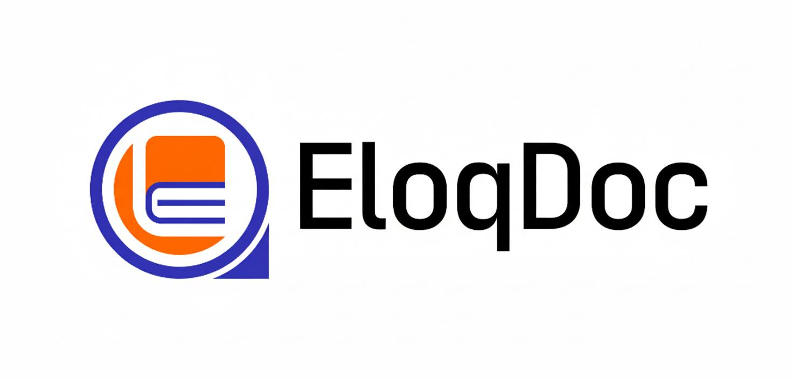
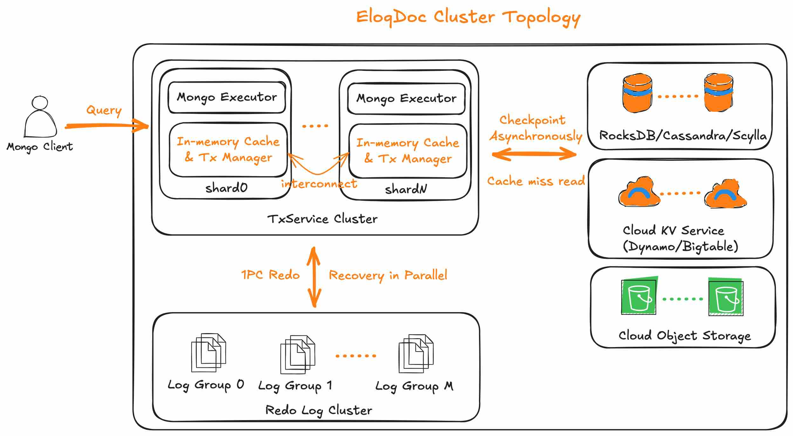
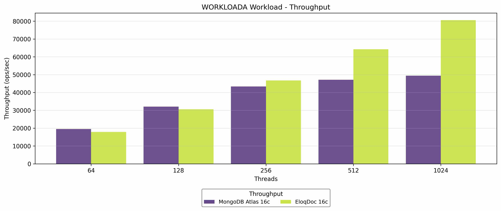
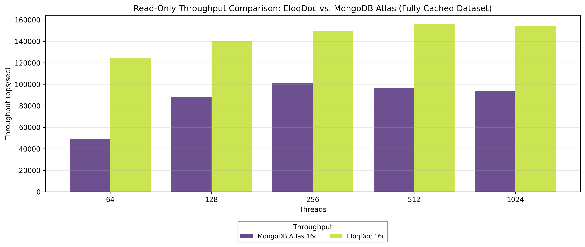
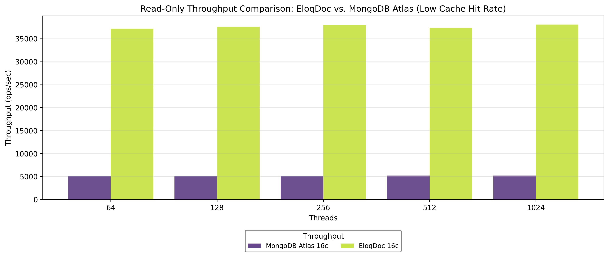

<div align="center">
<a href='https://www.eloqdata.com'>
</img>
</a>
  
---

[](https://github.com/eloqdata/eloqdoc/blob/readme/LICENSE)
[](https://isocpp.org/)
[](https://github.com/eloqdata/eloqdoc/issues)
[](https://www.eloqdata.com/download)
<a href="https://discord.com/invite/nmYjBkfak6">
  
</a>
</div>

# EloqDoc

A MongoDB API compatible , high-performance, elastic, distributed document database.

[](https://github.com/eloqdata/eloqdoc/stargazers)

---

## Overview

EloqDoc is a high-performance, distributed transactional document database with MongoDB API compatibility. Its breakthrough architecture, powered by [Data Substrate](https://www.eloqdata.com/blog/2024/08/11/data-substrate), redefines the balance between cost, scalability, and performance for real-world document workloads.

Unlike MongoDB, which relies on three replica-set nodes for durability, EloqDoc treats cloud object storage as a first-class citizen. Durable, cross–availability zone (AZ) object storage serves as the persistent foundation, while local NVMe caching accelerates reads. Recent updates are written to a decoupled redo log component. This architecture minimizes write latency while maintaining strong consistency and durability.

The result is a cloud-native, storage-centric deployment model: EloqDoc typically runs a single compute replica with storage-level high availability, orchestrated by Kubernetes for automatic failover. This approach cuts infrastructure costs, avoids redundant CPU and memory overhead, and delivers higher throughput across mixed read/write workloads.

Explore [EloqDoc](https://www.eloqdata.com/product/eloqdoc) for more details, or skip ahead to the Key Features section for a deeper breakdown. You can also experience the managed cloud version at [EloqCloud](https://cloud.eloqdata.com).

👉 **Use Cases**: web applications, document stores, content platforms—anywhere you need MongoDB API compatibility **and** expect distributed performance and elasticity.

---

## Key Features

### ⚙️ MongoDB API Compatibility

Seamlessly integrates with MongoDB clients, drivers, and tools, enabling you to use existing MongoDB workflows with a distributed backend.

### 🗃️ Tiered Storage Architecture

EloqDoc seamlessly manages hot and cold data across **memory, local NVMe cache, and object storage**. Since NVMe storage is ephemeral and lost when a node crashes, EloqDoc uses it strictly as a cache for object storage. This design ensures that all data remains safe and durable in cross-AZ object storage while still benefiting from NVMe-level performance for frequently accessed data.

### 🌐 Truely Distributed Database

Supports **multiple writers** and **fast distributed transactions**, ensuring high concurrency and fault tolerance across a cluster without sharding complexity.

### 🔄 Elastic Scalability

- Scales compute and memory **100x faster** than traditional databases by avoiding data movement on disk.
- Scales storage independently, so CPU resources remain constant when data volume grows but traffic stays the same.
- Scales redo logs independently to optimize write throughput.

### 🔥 High-Performance Transactions

Delivers **ACID transaction support** with especially fast distributed transactions, making it suitable for mission-critical applications.

### 🔒 Simplified Distributed Design

Operates as a distributed database without requiring a sharding coordinator (e.g., `mongos`), reducing operational complexity and overhead.

---

## Architecture

<div align="center">
<a href='https://www.eloqdata.com'>
</img>
</a>
</div>

EloqDoc is a decoupled, distributed database built on [Data Substrate](https://www.eloqdata.com/blog/2025/07/14/technology), the innovative new database foundation developed by EloqData.

Each EloqDoc instance includes a frontend, compatible with the MongoDB protocol, deployed together with the core TxService to handle data operations. A logically independent LogService handles Write Ahead Logging (WAL) to ensure persistence, while a Storage Service manages memory state checkpoints and cold data storage.

This architecture enable EloqDoc to support:
- **Fast Scaling**: Compute and memory scale independently without disk data movement, enabling rapid elasticity for dynamic workloads.
- **Storage Flexibility**: Storage scales separately from compute, optimizing resource allocation and reducing waste.
- **Write Optimization**: Independent redo log scaling boosts write throughput, ideal for high-velocity data ingestion.
- **No Sharding Overhead**: Distributes data natively across the cluster, eliminating the need for additional sharding components.

---

## Benchmark

We evaluated EloqDoc against MongoDB Atlas across representative deployment scenarios, ranging from fully in-memory workloads to cases where the working set does not fit in cache. All tests were executed on 16-core database nodes configured with identical client concurrency and dataset characteristics.

**Key takeaways**
- EloqDoc sustained up to 60% higher throughput than MongoDB Atlas for mixed 1:1 read/write workloads when the active dataset was fully cached.
- For read-heavy applications, EloqDoc delivered roughly 60% higher peak throughput while maintaining lower latency across the entire concurrency range.
- When the workload required frequent disk accesses, EloqDoc’s local NVMe cache + object storage design preserved performance and availability, whereas Atlas’s EBS-backed tier became IO-bound.

### Fully Cached Results

**Mixed read/write (1:1)** – EloqDoc maintained higher throughput under heavy contention and peaked at roughly 60% more operations per second than Atlas.

<div align="center">
<a href='https://www.eloqdata.com'>
</img>
</a>
</div>

**Read-only** – EloqDoc achieved high throughput even at moderate concurrency, sustaining about 60% higher throughput compared with Atlas.

<div align="center">
<a href='https://www.eloqdata.com'>
</img>
</a>
</div>

### Low Cache Hit Rate Results

For datasets that exceed available memory, we configured both systems to serve 150 million documents, forcing regular cache misses. EloqDoc leverages local NVMe as a write-back cache layered over durable object storage. This architecture delivered hundreds of thousands of IOPS while keeping data fully resilient. In contrast, the Atlas deployment backed by network EBS volumes saturated its IO budget, leading to noticeably lower throughput and higher tail latency.

<div align="center">
<a href='https://www.eloqdata.com'>
</img>
</a>
</div>

We will publish a more detailed benchmarks in future.

  
---

## Quick Start

### Try EloqDoc-RocksDB Using Official Package

**Step-1**, download the official package for EloqDoc-RocksDB. Please select the package that matches your operating system.

```bash
wget -c https://download.eloqdata.com/eloqdoc/eloqdss_rocksdb/eloqdoc-0.2.6-ubuntu22-amd64.tar.gz
```

All released package can be found at [download](https://www.eloqdata.com/download) page.

**Step-2**, uncompress the package to your `$HOME`.

```bash
mkdir $HOME/eloqdoc-rocksdb && tar -xf eloqdoc-0.2.6-ubuntu22-amd64.tar.gz -C $HOME/eloqdoc-rocksdb
```

After uncompress the package, you should see three directories: `bin`, `lib`, and `etc`.
`bin` contains all executable files, `lib` contains all dependencies, and `etc` contains an example configuration file `eloqdoc.conf`. Switch to `eloqdoc-rocksdb` to verify that.

```bash
cd $HOME/eloqdoc-rocksdb && ls
```

**Step-3**, create a data directory and a log directory. Simply place them under `$HOME/eloqdoc-rocksdb`.

```bash
mkdir db logs
```

**Step-4**, modify  `etc/eloqdoc.conf`. Assume your `$HOME` is `/home/eloq`, then

* Set `systemLog.path` to `/home/eloq/eloqdoc-rocksdb/logs/eloqdoc.log`.
* Set `storage.dbPath` to `/home/eloq/eloqdoc-rocksdb/db`.

**Step-5**, start the server with:

```bash
./bin/eloqdoc --config ./etc/eloqdoc.conf
```

**Step-6**, open another terminal and run mongo client.

```bash
./bin/eloqdoc-cli --eval "db.t1.save({k: 1}); db.t1.find();"
```

It should output

```bash
connecting to: mongodb://127.0.0.1:27017
Implicit session: session { "id" : UUID("288393c1-aff6-4a84-ad46-dee6691b361d") }

{ "_id" : ObjectId("68493ec41cc981ea926ec094"), "k" : 1 }
```

### Try EloqDoc-RocksDBCloud Using Official Package

**Step-1**, download the official package for EloqDoc-RocksDBCloud. Please select the package that matches your operating system.

```bash
wget -c https://download.eloqdata.com/eloqdoc/rocks_s3/eloqdoc-0.2.6-ubuntu22-amd64.tar.gz
```

All released package can be found at [download](https://www.eloqdata.com/download) page.

**Step-2**, uncompress the package to your `$HOME`.

```bash
mkdir $HOME/eloqdoc-rocksdbcloud && tar -xf eloqdoc-0.2.6-ubuntu22-amd64.tar.gz -C $HOME/eloqdoc-rocksdbcloud
```

After uncompress the package, you should see three directories: `bin`, `lib`, and `etc`.
`bin` contains all executable files, `lib` contains all dependencies, and `etc` contains an example configuration file `eloqdoc.conf`. Switch to `eloqdoc-rocksdbcloud` to verify that.

```bash
cd $HOME/eloqdoc-rocksdbcloud && ls
```

**Step-3**, create a data directory and a log directory. Simply place them under `$HOME/eloqdoc-rocksdbcloud`.

```bash
mkdir db logs
```

**Step-4**, start a S3 emulator, takes `minio` as an exmaple.

```bash
cd $HOME
mkdir minio-service && cd minio-service
wget https://dl.min.io/server/minio/release/linux-amd64/minio
chmod +x minio
./minio server ./data
```

By default, `minio` listens on `http://127.0.0.1:9000`, whose default credentials is `minioadmin:minioadmin`,.

**Step-5**, go back to `$HOME/eloqdoc-rocksdbcloud` and modify `etc/eloqdoc.conf`. Assume your `$HOME` is `/home/eloq`.

```bash
cd $HOME/eloqdoc-rocksdbcloud
```

* Set `systemLog.path` to `/home/eloq/eloqdoc-rocksdbcloud/logs/eloqdoc.log`.
* Set `storage.dbPath` to `/home/eloq/eloqdoc-rocksdbcloud/db`.
* `etc/eloqdoc.conf` has configured minio as its cloud storage, and needs no modification.

**Step-6**, start the server with:

```bash
./bin/eloqdoc --config ./etc/eloqdoc.conf
```

**Step-7**, open another terminal and run mongo client.

```bash
./bin/eloqdoc-cli --eval "db.t1.save({k: 1}); db.t1.find();"
```

It should output

```bash
connecting to: mongodb://127.0.0.1:27017
Implicit session: session { "id" : UUID("288393c1-aff6-4a84-ad46-dee6691b361d") }

{ "_id" : ObjectId("68493ec41cc981ea926ec094"), "k" : 1 }
```

---

## Advanced Topics

* Follow [compile tutorial](docs/how-to-compile.md) to learn how to compile EloqDoc-RocksDB and EloqDocRocksDBCloud from scratch.
* Follow [deploy cluster](docs/how-to-deploy-cluster.md) to learn how to deploy an EloqDoc-RocksDBCloud cluster.
* Follow [configuration description](docs/configuration-description.md) to learn major configuration parameters.

---

**Star This Repo ⭐** to Support Our Journey — Every Star Helps Us Reach More Developers!
